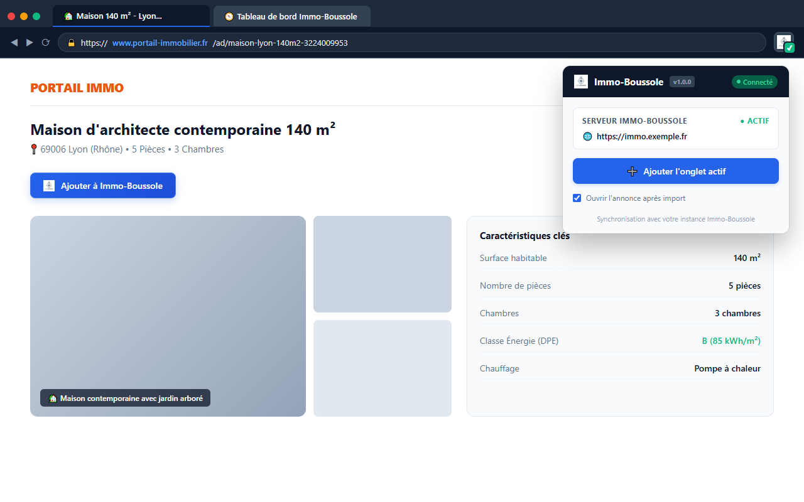

# 🧩 Extension Web Immo-Boussole

[](https://github.com/Immo-Boussole/immo-boussole-extension/actions)
[](https://github.com/Immo-Boussole/immo-boussole/wiki)
[](LICENSE)

> 🧭 **Organisation Immo-Boussole** : [Application Web](https://github.com/Immo-Boussole/immo-boussole) • [Extension Web](https://github.com/Immo-Boussole/immo-boussole-extension) • [Orchestrateur](https://github.com/Immo-Boussole/immo-boussole-orchestrator) • [Wiki Central](https://github.com/Immo-Boussole/immo-boussole/wiki)

---

## 🌐 Langues

- 🇬🇧 [English (Default)](README.md)
- 🇫🇷 [Français](README.fr.md)

---

Extension officielle pour **Immo-Boussole**, compatible avec **Firefox**, **Google Chrome** et **Microsoft Edge**.

---

## 📸 Aperçu

<p align="center">
  
</p>

<p align="center">
  
</p>

---

## 🌟 Fonctionnalités

- **Boutons d'action intégrés** : Inscription automatique de boutons *"🧭 Ajouter à Immo-Boussole"* sur chaque carte d'annonce (recherche) et directement sur les pages d'annonces détaillées (**LeBonCoin**, **Figaro Immobilier**, **SeLoger**, **Hektor / Immo-Rêve**).
- **Pré-extraction DOM intelligente** : Capture instantanée du titre, prix, surface, nombre de pièces, photos et URL sans dépendre uniquement des requêtes réseaux du backend.
- **Stockage local sécurisé** : L'URL de votre instance serveur et votre clé d'API Bearer Token sont conservées dans l'espace isolé sécurisé de votre navigateur (`browser.storage.local`).
- **Popup de contrôle** : Interface dans la barre d'outils pour tester la connectivité serveur, renseigner vos identifiants et ajouter l'onglet actif en un clic.
- **Multi-langues (i18n)** : Détection automatique de la langue du navigateur (Anglais par défaut, Français inclus). Traduction communautaire simple et ouverte ([TRANSLATING.md](TRANSLATING.md)).

---

## 📚 Documentation & Guides Wiki

Des guides détaillés d'installation et d'utilisation sont disponibles sur le **[Wiki Central GitHub](https://github.com/Immo-Boussole/immo-boussole/wiki)** :

| Guide | Description | Lien |
|---|---|---|
| 🧩 **Guide de l'Extension Web** | Installation et utilisation sur Firefox, Chrome et Edge | [Consulter le Guide](https://github.com/Immo-Boussole/immo-boussole/wiki/WebExtension-Setup-FR) |
| 🧭 **Architecture & Écosystème** | Architecture globale de l'écosystème Immo-Boussole | [Consulter le Guide](https://github.com/Immo-Boussole/immo-boussole/wiki/Architecture-Overview-FR) |

---

## 🚀 Installation & Développement

### Dépendances

```bash
npm install
```

### Compilation

- **Pour Firefox** :
  ```bash
  npm run build:firefox
  ```
  Le dossier compilé est généré dans `dist-firefox/`.

- **Pour Chrome & Edge** :
  ```bash
  npm run build:chrome
  ```
  Le dossier compilé est généré dans `dist-chrome/`.

---

## 🦊 Charger l'extension dans Firefox (Développement)

1. Ouvrez Firefox et accédez à `about:debugging#/runtime/this-firefox`.
2. Cliquez sur **"Charger un module d'extension temporaire..."**.
3. Sélectionnez `dist-firefox/manifest.json`.

---

## 🌐 Charger l'extension dans Chrome / Edge (Développement)

1. Ouvrez Chrome/Edge et accédez à `chrome://extensions` ou `edge://extensions`.
2. Activez le **Mode développeur** (en haut à droite).
3. Cliquez sur **"Charger l'extension non paquetée"** (*Load unpacked*).
4. Sélectionnez le dossier `dist-chrome/`.

---

## 🚀 Publication sur les Stores & CI/CD

L'extension est automatiquement compilée, packagée, signée et publiée sur les Stores à chaque création d'un Tag de release Git (`v*`) :
- **Chrome Web Store**
- **Mozilla Firefox Add-ons (AMO)**
- **Microsoft Edge Add-ons**

Pour la création des comptes développeur et la configuration des Secrets GitHub, consultez le [Guide de Configuration Multi-Stores](docs/STORE_PUBLISHING_SETUP.md).

---

## 🌍 Traductions communautaires

Vous souhaitez traduire l'extension dans une autre langue ? Consultez [TRANSLATING.md](TRANSLATING.md) pour un guide simple étape par étape !

---

## 🔐 Sécurité & Confidentialité

- **Communication Directe** : L'extension communique exclusivement avec votre instance privée Immo-Boussole via des requêtes API REST authentifiées par jeton d'accès sécurisé.
- **Zéro Pistage** : Aucune télémétrie, aucun traceur, aucune collecte de données personnelles.
- **[Politique de Confidentialité](PRIVACY.fr.md)**
- **[Conditions Générales d'Utilisation](TERMS.fr.md)**

---

## 📄 Licence

Ce projet est distribué sous licence [MIT](LICENSE).

---

*Fait partie de l'organisation [Immo-Boussole](https://github.com/Immo-Boussole).*
