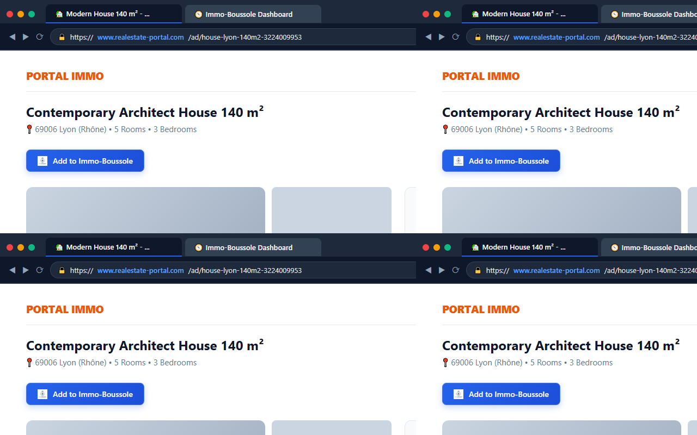
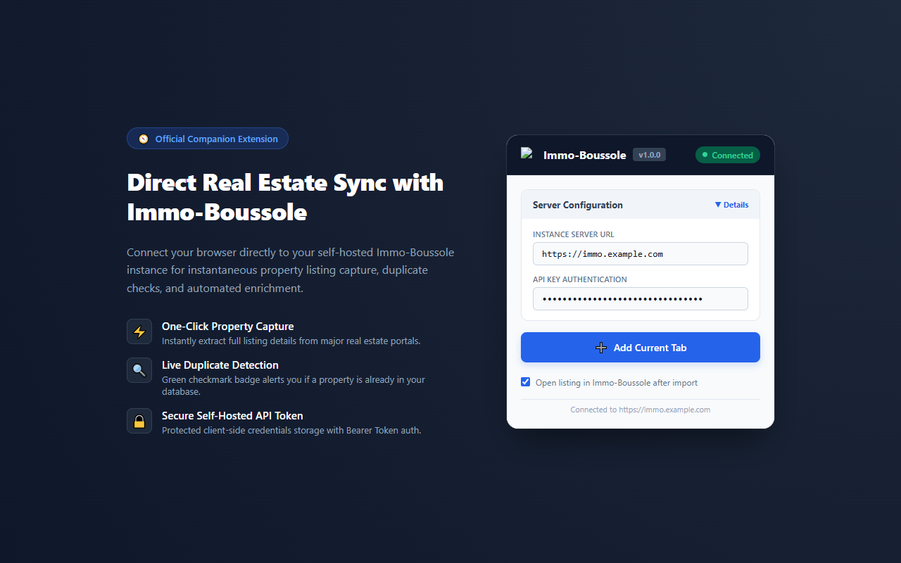

# 🧩 Immo-Boussole WebExtension

[](https://github.com/Immo-Boussole/immo-boussole-extension/actions)
[](https://github.com/Immo-Boussole/immo-boussole/wiki)
[](LICENSE)

> 🧭 **Immo-Boussole Organization**: [Core Web App](https://github.com/Immo-Boussole/immo-boussole) • [WebExtension](https://github.com/Immo-Boussole/immo-boussole-extension) • [Orchestrator](https://github.com/Immo-Boussole/immo-boussole-orchestrator) • [Central Wiki](https://github.com/Immo-Boussole/immo-boussole/wiki)

---

## 🌐 Languages

- 🇬🇧 [English (Default)](README.md)
- 🇫🇷 [Français](README.fr.md)

---

Official browser extension for **Immo-Boussole**, compatible with **Firefox**, **Google Chrome**, and **Microsoft Edge**.

---

## 📸 Preview

<p align="center">
  
</p>

<p align="center">
  
</p>

---

## 🌟 Features

- **Integrated Action Buttons**: Automatically injects *"🧭 Add to Immo-Boussole"* buttons on listing cards in search results and directly on property detail pages across supported platforms (**LeBonCoin**, **Figaro Immobilier**, **SeLoger**, **Hektor / Immo-Rêve**).
- **Smart DOM Pre-extraction**: Instantly captures title, price, area, rooms, photos, and URL without relying solely on backend network scrapers.
- **Secure Local Storage**: Instance server URL and Bearer API Token are safely preserved in browser-isolated local storage (`browser.storage.local`).
- **Control Popup**: Toolbar popup allowing live connection health checks, credentials setup, and single-click capture of the active browser tab.
- **Multi-language (i18n)**: Automatically detects browser UI language (English default, French included). Easily extensible by the community ([TRANSLATING.md](TRANSLATING.md)).

---

## 📚 Documentation & Wiki Guides

Detailed user and setup guides are available on the **[Central GitHub Wiki](https://github.com/Immo-Boussole/immo-boussole/wiki)**:

| Guide | Description | Link |
|---|---|---|
| 🧩 **WebExtension Setup & Usage** | Complete setup and usage on Firefox, Chrome, and Edge | [Read Guide](https://github.com/Immo-Boussole/immo-boussole/wiki/WebExtension-Setup-EN) |
| 🧭 **Architecture & Ecosystem** | Overall architecture of Immo-Boussole | [Read Guide](https://github.com/Immo-Boussole/immo-boussole/wiki/Architecture-Overview-EN) |

---

## 🚀 Installation & Development

### Dependencies

```bash
npm install
```

### Build

- **For Firefox**:
  ```bash
  npm run build:firefox
  ```
  The compiled extension is output to `dist-firefox/`.

- **For Chrome & Edge**:
  ```bash
  npm run build:chrome
  ```
  The compiled extension is output to `dist-chrome/`.

---

## 🦊 Load Temporary Extension in Firefox (Development)

1. Open Firefox and navigate to `about:debugging#/runtime/this-firefox`.
2. Click **"Load Temporary Add-on..."**.
3. Select `dist-firefox/manifest.json`.

---

## 🌐 Load Unpacked Extension in Chrome / Edge (Development)

1. Open Chrome/Edge and navigate to `chrome://extensions` or `edge://extensions`.
2. Enable **Developer mode** (top-right toggle).
3. Click **"Load unpacked"**.
4. Select the `dist-chrome/` folder.

---

## 🚀 Store Publishing & CI/CD

The extension is automatically built, packaged, signed, and published to stores on every GitHub release tag (`v*`):
- **Chrome Web Store**
- **Mozilla Firefox Add-ons (AMO)**
- **Microsoft Edge Add-ons**

For setting up store developer accounts and GitHub Secrets, see the [Store Publishing Setup Guide](docs/STORE_PUBLISHING_SETUP.md).

---

## 🌍 Community Translations

Want to add your language? See [TRANSLATING.md](TRANSLATING.md) for a quick step-by-step guide!

---

## 🔐 Security & Privacy

- **Direct Communication**: The extension interacts exclusively with your designated Immo-Boussole server instance via authenticated REST API tokens.
- **Zero Tracking**: No telemetry, no analytics, no third-party data collection.
- **[Privacy Policy](PRIVACY.md)**
- **[Terms of Service](TERMS.md)**

---

## 📄 License

This project is licensed under the [MIT License](LICENSE).

---

*Part of the [Immo-Boussole](https://github.com/Immo-Boussole) organization.*
